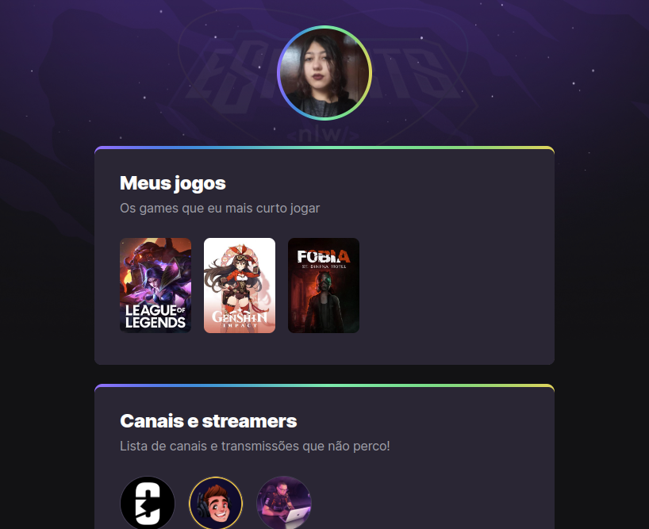

# Objetivo

Projeto desenvolvido durante a semana de programação da Rockseat, NLW eSports.

***#TrilhaExplorer***

>[Para ver o site clique aqui](https://hinale.github.io/nlw-esports-explorer/)

# Tecnologias usadas
- HTML
- CSS
- Git e Github

# Etapas

## Primeiro dia ─ 11/09/2022
- Montagem do ambiente:
  - VS Code, Figma, Github preparados;
  - Criado repositório local.

## Segundo dia ─ 12/09/2022
- Criação do index.html e feita a base do arquivo:
  - header com a imagem de perfil;
  - main com o conteúdo das section;
  - section de jogos, canais e redes sociais.

## Terceiro dia ─ 13/09/2022
- Criação da folha de estilo, arquivo style.css:
  - feita estilização da main;
  - uso de background-image com url();
  - section separadas com classes;
  - adicionado fonte do Google Fonts, Intel(400 regular, 900 bold);

## Quarto dia ─ 14/09/2022
- Continuação da folha de estilo, arquivo style.css:
  - feita a estilização da header;
  - uso de animação na header e section.
- Iniciado repositório local.

## Quinto dia - 15/09/2022
- Feitos push do projeto para Github.
- Adicionado README:
 - adicionada imagem de preview;
 - adicionado link para página de visualização do projeto.
- Finalizado projeto.